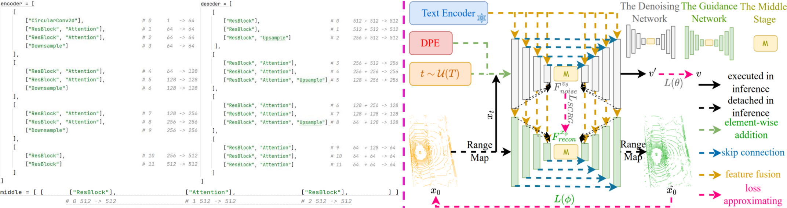
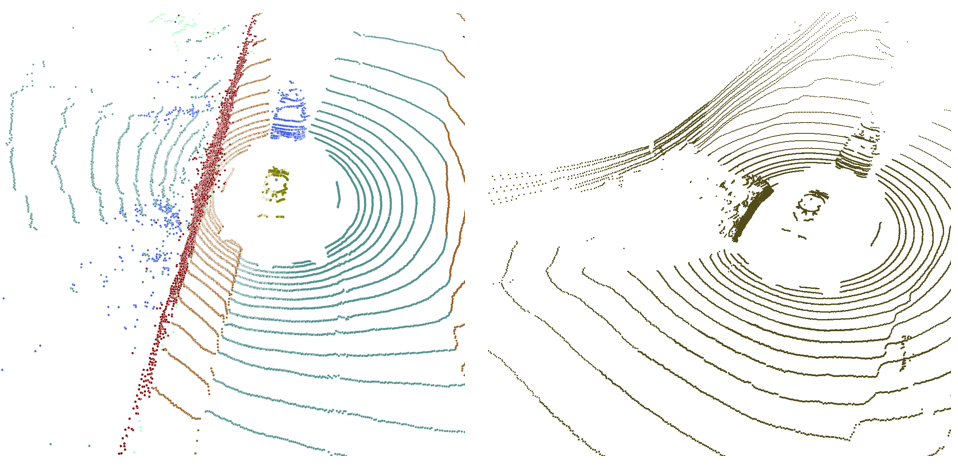
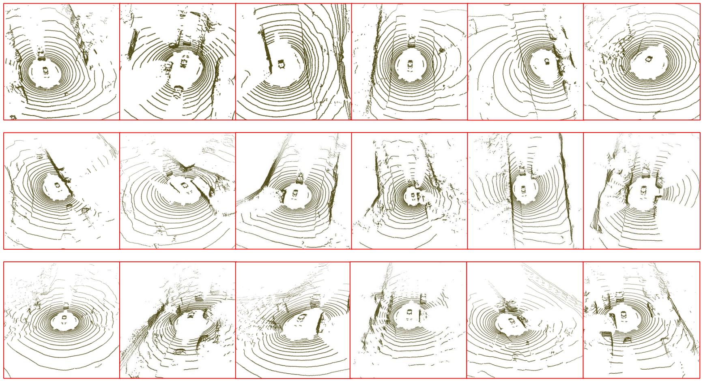

# T2LDM

This repo is the official project repository of the paper **_A Self-Conditioned Representation Guided Diffusion Model for Realistic Text-to-LiDAR Scene Generation_**. 
 -  [ [arXiv](https://arxiv.org/abs/2511.19004) ], [ [CVPR](xxxx) ] 
 - **_Our paper has been accepted by CVPR 2026!_**
 - **_Released model weights are temporarily as the model structure of T2LDM may be adjusted later._**
 - **_The code wiil further be updated for nuScenes, KITTI360 and SemanticKITTI!_**

## Overall Framework 
 <br/>

## Citation
If you find our paper useful to your research, please cite our work as an acknowledgment.
```bib
@article{qu2025self,
  title={A Self-Conditioned Representation Guided Diffusion Model for Realistic Text-to-LiDAR Scene Generation},
  author={Qu, Wentao and Mei, Guofeng and Wu, Yang and Gong, Yongshun and Huang, Xiaoshui and Xiao, Liang},
  journal={arXiv preprint arXiv:2511.19004},
  year={2025}
}
```

## Codebase
**_T2LDM_** is built upon the codebase of **_R2DM_** and **_Text2LiDAR_**. We further refine and optimize this codebase with the hope of contributing to the LiDAR generation community.

### 1. Simple Dataset Form
The original dataset follows a TensorFlow-style design, which is not convenient for reading and debugging. T2LDM follows a PyTorch-style implementation and introduces a validation dataset(ConditionalX0) to facilitate monitoring intermediate generation results.
```
  # If you want to create your dataset, please check:
    data/new_dataset/new_dataset.py
```

### 2. Supporting Multi-GPU Generation
We rewrote the generation code to support generation samples using multiple GPUs.
```
  # Please check:
    generation_mgpus_{task}_{dataset}.py
```
### 3. Friendly Generation Result
The original code only produces the BEV PNGs from generation Range Maps. <br/>
Our code directly transfer RMs to PCs for results. <br/>
For Text-to-LiDAR, the code saves texts and PCs. <br/>
For Semantic-to-LiDAR, the code saves semantics, GT PCs and generated colorful PCs.
```
  # Please check:
    utils/lidar.py
```
 <br/>

### 4. Flexible Network Framework
The network framework of T2LDM is flexible. We can easily adjust the framework only though changing the network list.
```
  # Please check:
    models/T2LDM.py
    
  def get_encoder_deocder_gn():
    ...
   
  def get_encoder_deocder_dn():
    ...
```

### 5. Supporting T5 Text Encoder
We add [ [T5](https://arxiv.org/abs/1910.10683) ] on T2LDM.
```
  # Please check: 
    models/T5/T5.py
    
  # Change the config file: utils/config_text_nuScenes.py
    clip_mode: None # closing the CLIP Text Encoder
    T5_mode: "base" # small(512), base(768), large(1024)
```

### Adding Some Tricks from Papers
1) [ [JIT(Back to Basics: Let Denoising Generative Models Denoise)](https://arxiv.org/abs/2511.13720) ]
2) [ [Gated Attention(Gated Attention for Large Language Models: Non-linearity, Sparsity, and Attention-Sink-Free, NeurIPS 2025, Best Paper)](https://arxiv.org/pdf/2505.06708) ]
3) [ [FreeU(FreeU: Free Lunch in Diffusion U-Net, CVPR 2024, Oral)](https://openaccess.thecvf.com/content/CVPR2024/papers/Si_FreeU_Free_Lunch_in_Diffusion_U-Net_CVPR_2024_paper.pdf) ]
4) [ [ScaleLong(ScaleLong: Towards More Stable Training of Diffusion Model via Scaling Network Long Skip Connection, NeurIPS 2023)](https://proceedings.neurips.cc/paper_files/paper/2023/file/ded98d28f82342a39f371c013dfb3058-Paper-Conference.pdf) ]


## Overview
- [Installation](#installation)
- [Data Preparation](#data-preparation)
- [Model Zoo](#model-zoo)
- [Quick Start](#quick-start)

## Installation

### Requirements
The following environment is recommended for running **_T2LDM_** (four NVIDIA 3090 GPUs or eight NVIDIA 4090 GPUs):<br/>
**_If you only want to generate some LiDAR results, the Single 3090(24G)/3060(12G) GPU is enough!_**
- Ubuntu: 18.04 and above
- gcc/g++: 11.4 and above
- CUDA: 12.1
- PyTorch: 2.1.0
- python: 3.10

### Environment

#### Using environments.yaml (based on conda command)
```
  cd envs
  conda env create -f environment.yaml
  
  cd ../pointops
  python setup.py install
```

#### Using requirements.txt (based on pip command)
```
  conda create -n t2ldm python=3.10 -y
  conda activate t2ldm

  cd envs

  pip install -r requirements.txt

  pip install torch==2.1.0 torchvision==0.16.0 torchaudio==2.1.0 --index-url https://download.pytorch.org/whl/cu121
  pip install ema-pytorch==0.4.8 kornia==0.7.0 accelerate==0.22.0

  cd ../pointops
  python setup.py install
```

## Data Preparation

### nuScenes
- 1. Download the official [nuScenes](https://www.nuscenes.org/nuscenes#download) (or [Baidu Disk](https://pan.baidu.com/s/1Rsbi-Q_2EUm05lwQgn8T3Q?pwd=1111)(code:1111)) dataset (with Lidar Segmentation) and organize the downloaded files as follows:
  ```bash
  /root/dataset/rsd_data/nuscenes/v1.0-trainval
  │── samples
  │── sweeps
  │── lidarseg
  ...
  │── v1.0-trainval 
  │── v1.0-test
  ```
#### 1. T2LnuScenes (34149 Text-LiDAR Pairs)
- 1. Download the pkl files (**nuscenes_infos_10sweeps_train.pkl** and **nuscenes_infos_10sweeps_val.pkl**) from the Huggingface project of [HuggingFace](https://huggingface.co/QWTforHuggingFace/T2LDM/tree/main).
  ```
  # Running data/nuScenes/descriptor.py to generate nuscenes_infos_10sweeps_description.pkl.
  ROOT_PATH = "Your the path of pkl files"
  python descriptor.py
  ```
- 2. Of course, you also can download **generate nuscenes_infos_10sweeps_description.pkl** from [HuggingFace](https://huggingface.co/QWTforHuggingFace/T2LDM/tree/main). This size is about 9.33GB.<br/>
     Meanwhile, you can only download **point cloud files of nuScenes**: [HuggingFace](https://huggingface.co/QWTforHuggingFace/T2LDM/tree/main/KITTI360_download_address).<br/>
     This means that  this is allowed you to retrain T2LDM using **generate nuscenes_infos_10sweeps_description.pkl** + **point cloud files of nuScenes**.

#### 2. T2LnuScenes++ (107816 Text-LiDAR Pairs)
Please check **data/nuScenes/description_plus_class.txt** and **data/nuScenes/description_plus_text.txt** to know the related information for **T2LnuScenes++**.

- 1. Generating the **generate nuscenes_infos_10sweeps_description.pkl** + **point cloud files of nuScenes**.
   ```
  # Running data/nuScenes/descriptor_plus.py to generate text.pkl.
  ROOT_PATH = "Your the path of pkl files"
  python descriptor_plus.py
  ```
- 2. Of course, you also can download **text.pkl** from [HuggingFace](https://huggingface.co/QWTforHuggingFace/T2LDM/tree/main/KITTI360_download_address).

### KITTI360
- 1. Dowload the official [KITTI360 (Raw Velodyne Scans (119G))](https://www.cvlibs.net/datasets/kitti-360/download.php) and organize the download files as follows:
```
  /root/dataset/KITTI360/data_3d_raw
  │── 2013_05_28_drive_0000_sync
  │── 2013_05_28_drive_0002_sync
  │── 2013_05_28_drive_0003_sync
  ...
  │── 2013_05_28_drive_0009_sync
  │── 2013_05_28_drive_0010_sync
```
- 2. Of course, you also download the KITTI360 address on [HuggingFace](https://huggingface.co/QWTforHuggingFace/T2LDM/tree/main/KITTI360_download_address).
 
### SemanticKITTI
- 1. Dowload the official [SemanticKITTI (https://semantic-kitti.org/dataset.html) and organize the download files as follows:
```
  /root/dataset/SemanticKITTI/dataset/sequences
  │── 00
  │── 01
  │── 02
  ...
  │── 20
  │── 21
```


## Model Zoo
We create a Huggingface project (QWTforHuggingFace/T2LDM) for [HuggingFace](https://huggingface.co/QWTforHuggingFace/T2LDM/tree/main). Please download something from Huggingface.<br/>
<br/>
I am very sorry for no space of my Google Cloud Disk. Please download something by the Baidu Disk or HuggingFace. <br/>
As I rewrote the code of T2LDM, I have to retrain T2LDM. However, I currently don't have eight 4090 NVIDIA GPUs, so T2LDM is retrained on four 3090 NVIDIA GPUs. 

### nuScenes
|              Model              |                    Task                 |                    Samples                 |                checkpoint              |
|:-------------------------------:|:---------------------------------------:|:------------------------------------------:|:--------------------------------------:|
|    Frozen SCRG on 10W Steps     |         Unconditional Generation        | [HuggingFace](https://huggingface.co/QWTforHuggingFace/T2LDM/tree/main/unconditional_nuScenes_full_training_scrg) | [HuggingFace](https://huggingface.co/QWTforHuggingFace/T2LDM/tree/main/unconditional_nuScenes_full_training_scrg) |
| Full Training SCRG on 40W Steps |         Unconditional Generation        | [Baidu Disk](https://pan.baidu.com/s/1FPwkhLbPHapUwskA8uegyA?pwd=1111), [Google Cloud Disk](https://drive.google.com/file/d/1F7t3gzUhQb_oJ6yO0Xrp0f_ZnVHUrVP8/view?usp=sharing), [HuggingFace](https://huggingface.co/QWTforHuggingFace/T2LDM/tree/main/unconditional_nuScenes_full_training_scrg) | [Baidu Disk](https://pan.baidu.com/s/1o-ejSMipUa7IpJN3FvEjiw?pwd=1111), [Google Disk](https://drive.google.com/file/d/1vKowjTH55FRLv5rL6BJ4-s-Jv3pVQs70/view?usp=sharing), [HuggingFace](https://huggingface.co/QWTforHuggingFace/T2LDM/tree/main/unconditional_nuScenes_full_training_scrg) |
|    Frozen SCRG on 10W Steps     |         Text-guied Generation        | [HuggingFace](https://huggingface.co/QWTforHuggingFace/T2LDM/tree/main/text_nuscenes_frozen_training_scrg) | [HuggingFace](https://huggingface.co/QWTforHuggingFace/T2LDM/tree/main/text_nuscenes_frozen_training_scrg) |
| Full Training SCRG on 40W Steps |         Text-guided Generation       | [HuggingFace](https://huggingface.co/QWTforHuggingFace/T2LDM/tree/main/text_nuscenes_full_training_scrg) | [HuggingFace](https://huggingface.co/QWTforHuggingFace/T2LDM/tree/main/text_nuscenes_full_training_scrg) |
|    40W Steps                    |     Semantic-to-LiDAR Generation     | [HuggingFace](https://huggingface.co/QWTforHuggingFace/T2LDM/tree/main/semantic_nuscenes) | [HuggingFace](https://huggingface.co/QWTforHuggingFace/T2LDM/tree/main/semantic_nuscenes) |

Some results from T2LDM with the Full Training SCRG checkpoint on nuScenes.
 <br/>

### KITTI360
|              Model              |                    Task                 |                    Samples                 |                checkpoint              |
|:-------------------------------:|:---------------------------------------:|:------------------------------------------:|:--------------------------------------:|
|    Frozen SCRG on 10W Steps     |         Unconditional Generation        | [HuggingFace](https://huggingface.co/QWTforHuggingFace/T2LDM/tree/main/unconditional_kitti360_frozen_training_scrg) | [HuggingFace](https://huggingface.co/QWTforHuggingFace/T2LDM/tree/main/unconditional_kitti360_frozen_training_scrg) |
| Full Training SCRG on 40W Steps |         Unconditional Generation        | [HuggingFace](https://huggingface.co/QWTforHuggingFace/T2LDM/tree/main/unconditional_kitti360_full_training_scrg) | [HuggingFace](https://huggingface.co/QWTforHuggingFace/T2LDM/tree/main/unconditional_kitti360_full_training_scrg) |

Some results from T2LDM with the Full Training SCRG checkpoint on KITTI360 (Sorry, I am too lazy to draw. Please see [Examples](https://huggingface.co/QWTforHuggingFace/T2LDM/tree/main/unconditional_nuScenes_full_training_scrg)).

### SemanticKITTI
|              Model              |                    Task                 |                    Samples                 |                checkpoint              |
|:-------------------------------:|:---------------------------------------:|:------------------------------------------:|:--------------------------------------:|
|    Frozen SCRG on 10W Steps     |         Unconditional Generation        | -- | -- |
| Full Training SCRG on 40W Steps |         Unconditional Generation        | [HuggingFace](https://huggingface.co/QWTforHuggingFace/T2LDM/tree/main/unconditional_semantickitti_full_training_scrg) | [HuggingFace](https://huggingface.co/QWTforHuggingFace/T2LDM/tree/main/unconditional_semantickitti_full_training_scrg) |

Some results from T2LDM with the Full Training SCRG checkpoint on SemanticKITTI (Sorry, I am too lazy to draw. Please see [Examples](https://huggingface.co/QWTforHuggingFace/T2LDM/tree/main/unconditional_semantickitti_full_training_scrg)).


## Quick Start

### Accelerate Configuration
Before the training and sampling, it must deploys the accelerate.
```
  conda activate t2ldm
  accelerate config
  # please finsh the accelerate configuration according to the tips.
```

### Problems with distributed training or generation

This issue is most likely caused by insufficient memory. In distributed training, the file **_nuscenes_infos_10sweeps_description.pkl (9.33 GB)_** is loaded multiple times, which leads to excessive memory usage. In practice, the "semantic" field occupies most of the storage.

To address this, you can split the "semantic" data into multiple .npy files and store only their file paths in the .pkl file. Then, modify dataset.py to load the semantic data on demand.

### Batch Size & Learning Rate
For the setting of batch size:
```
  # Please follow the linear scaling rule for Learning Rate, for example:
  Single GPU = 24G, BS = 4 (nuScenes) per GPU, BS = 2 (KITTI360, SemanticKITTI)  per GPU, lr = 1e-4
  Single GPU = 48G, BS = 8 (nuScenes) per GPU, BS = 4 , lr = 2e-4
  Single GPU = 80G, BS = 16 (nuScenes) per GPU, BS = 8 (KITTI360, SemanticKITTI) per GPU, lr = 4e-4
```

### Epoch
For the setting of training epoch:
```
  # Please follow the total iterations: Num GPU x Batch Size x Num Step = 12,800,000 (nuScenes), the total iterations = 6,400,000 (KITTI360, SemanticKITTI), for example:
  Single GPU = 24G,  four GPUS, BS = 4 (nuScenes) per GPU, EPOCH = 800,000, 4 x 4 x 800,000 = 12,800,000
  Single GPU = 24G,  eights GPUS, BS = 4 (nuScenes) per GPU, EPOCH = 400,000, 8 x 4 x 400,000 = 12,800,000

  Single GPU = 24G,  four GPUS, BS = 2 (KITTI360, SemanticKITTI) per GPU, EPOCH = 800,000, 4 x 2 x 800,000 = 6,400,000
  Single GPU = 24G,  eights GPUS, BS = 2 (KITTI360, SemanticKITTI) per GPU, EPOCH = 400,000, 8 x 2 x 400,000 = 6,400,000
```
Of course, T2LDM can achieve the better generation results on nuScenes, KITTI360 and SemanticKITTI with more training iterations.

### Training
The results are in the 'logs/diffusion/{task}/{time}/plys/generation' folder.

```
  # Changing the dataset path on: 
  #  utils/config_unconditional_nuScenes_gn_stage1.py
  #  utils/config_unconditional_nuScenes_gn_stage2.py

  # Important! Please set the num_steps(stage1.py) = num_step(stage2.py) to ensure the parameter continuity of optimizer and schedule.

  # Joint training on nuScenes for GN and DN on 0-10W Steps (10W on 8 GPUs, 20W on 4 GPUs).
  accelerate launch train_unconditional_nuScenes_gn_stage1.py 2>&1 | tee train.log
  
  # When finishing the 10W iterations, please add the frozen GN path on (freezing GN is an End-to-End process, due to loading the optimizer and lr_schedule parameters)
  #   utils/train_unconditional_nuScenes_gn_stage2.py
  #   pretrained_checkpoint_dir: str = "XX.pth"

  # Training on nuScenes for frozen GN and trainable DN on 10-40W Steps
  accelerate launch train_unconditional_nuScenes_gn_stage2.py 2>&1 | tee train.log

```
We find the best result for joint training of GN and DN
```
  # Changing the dataset path on: 
  #  utils/config_unconditional_nuScenes_gn_full_scrg.py

  # Training on nuScenes for trainable GN and trainable DN on 0-40W Steps
  accelerate launch train_unconditional_nuScenes_gn_full_scrg.py 2>&1 | tee train.log
```

### Training Sample for Debug
We also provide a training sample **_train_full_scrg_uncondtional_KITTI360_sample.py_** on KITTI360. <br/>
You only need to deploy the training environment. <br/>
```
 # Please run train_full_scrg_uncondtional_KITTI360_sample.py on Single GPU for the code debug.
```

### Generation
The results are in the 'test/{time}_{stpes}_ddpm{sample num}_{task}_{dataset}_{random seed}' folder.<br/>
The generation configuration is not related to the dataset configuration. <br/>
1) Deploying the conda environment
2) Downloading the checkpoint of nuScenes
   
```
  # Changing the checkpoint path on: 
  #   ckpt = "xx.pth"
  #   sampling_steps = 1024 # 64 
  
  # Unconditional Genration for nuScenes
  accelerate launch --main_process_port 29501  generate_mgpus_unconditional_nuScenes.py 2>&1 | tee test.log

  # Unconditional Genration for KITTI360
  accelerate launch --main_process_port 29501  generate_mgpus_unconditional_KITTI360.py 2>&1 | tee test.log

  # Text-guided Generation
  # Please use the function "decode_tensor" in common.py to decode the "text_rank_xxx.pkl" and obtain the true text content.
```
